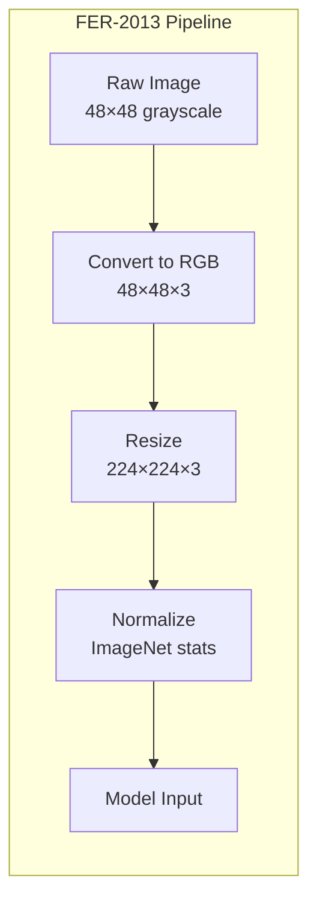
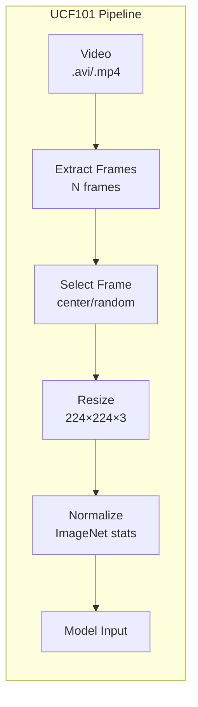

# Dataset Documentation

> **Comprehensive Guide to FER-2013 and UCF101 Datasets**

This document provides detailed information about the datasets used for emotion and activity recognition tasks.

---

## Table of Contents

1. [Dataset Overview](#dataset-overview)
2. [FER-2013 Dataset](#fer-2013-dataset)
3. [UCF101 Dataset](#ucf101-dataset)
4. [Data Preprocessing](#data-preprocessing)
5. [Class Distribution Analysis](#class-distribution-analysis)
6. [Challenges & Considerations](#challenges--considerations)

---

## Dataset Overview

| Dataset | Task | Classes | Input Type | Resolution |
|---------|------|---------|------------|------------|
| **FER-2013** | Facial Emotion Recognition | 7 | Grayscale→RGB | 48×48 → 224×224 |
| **UCF101** | Human Activity Recognition | 5 | Video Frames | 224×224 RGB |

---

## FER-2013 Dataset

### Overview



| Property | Value |
|----------|-------|
| **Full Name** | Facial Expression Recognition 2013 |
| **Origin** | ICML 2013 Challenges in Representation Learning |
| **Source** | [Kaggle](https://www.kaggle.com/datasets/msambare/fer2013) |
| **Total Images** | ~35,887 |
| **Image Format** | 48×48 grayscale PNG/JPG |
| **Label Source** | Crowd-sourced (Amazon Mechanical Turk) |

### Classes (7 Emotions)

| Index | Emotion | Description | Typical % |
|-------|---------|-------------|-----------|
| 0 | **Angry** | Furrowed brows, tight lips | ~10% |
| 1 | **Disgust** | Wrinkled nose, raised upper lip | **~1%** (rare) |
| 2 | **Fear** | Wide eyes, open mouth | ~10% |
| 3 | **Happy** | Smile, raised cheeks | **~25%** (common) |
| 4 | **Sad** | Drooping eyelids, frown | ~12% |
| 5 | **Surprise** | Raised eyebrows, open mouth | ~10% |
| 6 | **Neutral** | Relaxed face | ~15% |

### Data Split

```
FER-2013 Distribution
├── Training:   28,709 images (80.0%)
├── Validation:  3,589 images (10.0%)
└── Test:        3,589 images (10.0%)
    ─────────────────────────────────
    Total:      35,887 images
```

### Key Characteristics

**Strengths:**
- ✅ Large-scale dataset for emotion recognition
- ✅ Industry-standard benchmark
- ✅ Diverse subjects (age, ethnicity, pose)
- ✅ Real-world images (not lab-controlled)

**Challenges:**
- ⚠️ **Low resolution**: 48×48 pixels lose fine facial details
- ⚠️ **Class imbalance**: "Disgust" severely underrepresented
- ⚠️ **Label noise**: ~65% inter-rater agreement
- ⚠️ **Occlusions**: Glasses, hair, hands covering face
- ⚠️ **Pose variation**: Non-frontal faces common

### Benchmark Performance

| Model Type | Typical Accuracy |
|------------|------------------|
| Human Performance | ~65-70% |
| Traditional ML (SVM, RF) | ~45-55% |
| Basic CNN | ~55-65% |
| Deep CNN (VGG, ResNet) | ~65-72% |
| State-of-the-Art | ~73-76% |

> [!NOTE]
> FER-2013 is considered a challenging dataset. Validation accuracy of 65-70% is competitive.

---

## UCF101 Dataset

### Overview



| Property | Value |
|----------|-------|
| **Full Name** | UCF101 Action Recognition Dataset |
| **Origin** | University of Central Florida |
| **Source** | [UCF CRCV](https://www.crcv.ucf.edu/data/UCF101.php) |
| **Total Videos** | 13,320 (full) / ~500 (subset) |
| **Video Format** | AVI, 320×240, 25 fps |
| **Duration** | 2-10 seconds per clip |

### Classes (5-Class Subset)

| Index | Activity | Description | Use Case |
|-------|----------|-------------|----------|
| 0 | **Walking** | Person walking forward/backward | Surveillance, elder care |
| 1 | **Running** | Person jogging/sprinting | Security, sports |
| 2 | **Sitting** | Person seated on chair/ground | Office monitoring |
| 3 | **Standing** | Person standing still | Access control |
| 4 | **Jumping** | Person jumping/hopping | Fitness, sports |

### Data Split (Recommended)

```
UCF101 Subset Distribution
├── Training:   ~350 frames per class (70%)
├── Validation:  ~75 frames per class (15%)
└── Test:        ~75 frames per class (15%)
    ─────────────────────────────────────────
    Total:      ~500 frames per class × 5 = 2,500
```

### Frame Sampling Strategies

| Strategy | Description | Best For |
|----------|-------------|----------|
| **Center** | Middle frame of video | Fast training, stable predictions |
| **Random** | Random frame each epoch | Data augmentation, robustness |
| **Uniform** | Evenly spaced N frames | Multi-frame models (LSTM, 3D Conv) |

### Key Characteristics

**Strengths:**
- ✅ Real-world action videos
- ✅ Temporal motion patterns
- ✅ Diverse backgrounds and subjects
- ✅ Well-established benchmark

**Challenges:**
- ⚠️ **No temporal modeling**: Single-frame approach loses motion cues
- ⚠️ **Background variation**: Same action in different scenes
- ⚠️ **Intra-class variation**: Different body types, speeds, styles
- ⚠️ **Camera motion**: Some videos have shaky footage
- ⚠️ **Occlusions**: Multiple people, partial visibility

---

## Data Preprocessing

### Image Transformations

#### Training Transforms

```python
transforms.Compose([
    transforms.Resize((224, 224)),
    transforms.RandomHorizontalFlip(p=0.5),
    transforms.RandomRotation(degrees=15),  # Emotion: 15°, Activity: 10°
    transforms.ColorJitter(
        brightness=0.2,
        contrast=0.2,
        saturation=0.2,
        hue=0.1
    ),
    transforms.ToTensor(),
    transforms.Normalize(
        mean=[0.485, 0.456, 0.406],  # ImageNet stats
        std=[0.229, 0.224, 0.225]
    )
])
```

#### Validation/Test Transforms

```python
transforms.Compose([
    transforms.Resize((224, 224)),
    transforms.ToTensor(),
    transforms.Normalize(
        mean=[0.485, 0.456, 0.406],
        std=[0.229, 0.224, 0.225]
    )
])
```

### Why ImageNet Normalization?

Even though FER-2013 and UCF101 are not ImageNet, using ImageNet statistics:
- Enables transfer learning from pretrained models
- Provides consistent input distribution
- Well-tested numerical stability

---

## Class Distribution Analysis

### FER-2013 Class Imbalance

```
Class Distribution (Approximate)
────────────────────────────────────────────────
Happy    ████████████████████████████  25%
Neutral  ████████████████              15%
Sad      █████████████                 12%
Angry    ███████████                   10%
Fear     ███████████                   10%
Surprise ███████████                   10%
Disgust  █                              1%  ← Severely imbalanced
```

**Mitigation Strategies:**
1. **Class weights**: Weight loss function inversely to frequency
2. **Oversampling**: Duplicate minority class samples
3. **Data augmentation**: More augmentation for minority classes
4. **Focal loss**: Focus on hard examples

### UCF101 Class Balance

The 5-class subset is typically **well-balanced** with similar samples per class.

---

## Challenges & Considerations

### FER-2013 Specific

| Challenge | Impact | Solution |
|-----------|--------|----------|
| Low resolution | Loss of subtle expressions | Use attention mechanisms |
| Label noise | Ceiling on achievable accuracy | Expect ~65-70% as good |
| Class imbalance | Model biased toward "Happy" | Use class weights |
| Grayscale input | Miss color cues (redness) | Convert to RGB anyway |

### UCF101 Specific

| Challenge | Impact | Solution |
|-----------|--------|----------|
| Single frame | No motion information | Use optical flow or 3D CNN |
| Background clutter | Model learns background | Use person detection first |
| Viewpoint variation | Same action looks different | More augmentation |
| Similar activities | Confusion (walk vs. stand) | More training data |

### General Deep Learning Challenges

| Issue | Symptom | Fix |
|-------|---------|-----|
| **Overfitting** | Train acc >> Val acc | Dropout, more data, regularization |
| **Underfitting** | Low train accuracy | More capacity, longer training |
| **Vanishing gradients** | Loss stuck | BatchNorm, residual connections |
| **Class imbalance** | Ignores minority classes | Weighted loss, oversampling |

---

## Dataset Directory Structure

```
datasets/
├── FER2013/
│   ├── train/
│   │   ├── Angry/
│   │   │   └── *.jpg
│   │   ├── Disgust/
│   │   ├── Fear/
│   │   ├── Happy/
│   │   ├── Sad/
│   │   ├── Surprise/
│   │   └── Neutral/
│   ├── val/
│   │   └── (same structure)
│   └── test/
│       └── (same structure)
│
└── UCF101/
    ├── train/
    │   ├── Walking/
    │   │   └── *.jpg
    │   ├── Running/
    │   ├── Sitting/
    │   ├── Standing/
    │   └── Jumping/
    ├── val/
    │   └── (same structure)
    └── test/
        └── (same structure)
```

---

## References

1. **FER-2013**: Goodfellow, I. J., et al. (2013). "Challenges in Representation Learning: A Report on Three Machine Learning Contests." *Neural Networks*.

2. **UCF101**: Soomro, K., Zamir, A. R., & Shah, M. (2012). "UCF101: A Dataset of 101 Human Actions Classes From Videos in The Wild." *arXiv preprint arXiv:1212.0402*.

3. **Data Augmentation**: Shorten, C., & Khoshgoftaar, T. M. (2019). "A Survey on Image Data Augmentation for Deep Learning." *Journal of Big Data*.

---

*Documentation for Emotion and Activity Detection Project*
