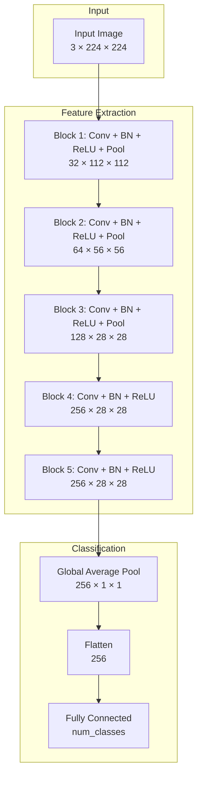
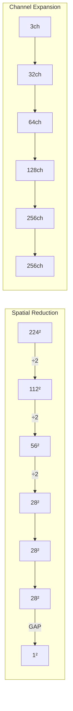
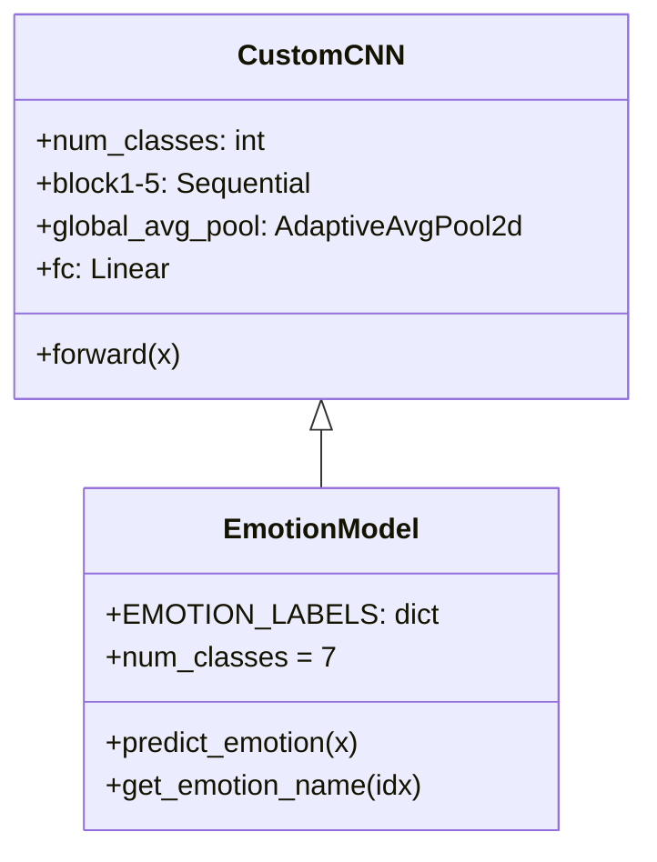
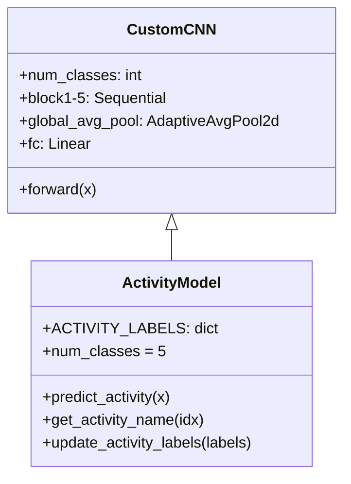

# Custom CNN Model Architecture Documentation

> **From-Scratch Deep Learning Models for Emotion and Activity Recognition**

This document provides comprehensive documentation for the custom CNN architectures designed for two image classification tasks: Facial Emotion Recognition and Human Activity Recognition.

---

## Table of Contents

1. [Architecture Overview](#architecture-overview)
2. [Base CustomCNN Architecture](#base-customcnn-architecture)
3. [Data Flow Visualization](#data-flow-visualization)
4. [Component Justification](#component-justification)
5. [Task-Specific Models](#task-specific-models)
6. [Parameter Analysis](#parameter-analysis)
7. [Design Decisions & Trade-offs](#design-decisions--trade-offs)

---

## Architecture Overview

The custom CNN is a **5-block convolutional neural network** designed as a research baseline model. It follows a classic CNN paradigm with progressive channel expansion, batch normalization, and global average pooling.



### Key Characteristics

| Property | Value |
|----------|-------|
| **Input Size** | 224 × 224 × 3 (RGB) |
| **Total Blocks** | 5 convolutional |
| **Channel Progression** | 3 → 32 → 64 → 128 → 256 → 256 |
| **Pooling Strategy** | MaxPool (first 3 blocks) + Global Average Pool |
| **Normalization** | BatchNorm after every convolution |
| **Activation** | ReLU (inplace) |
| **Parameters (7 classes)** | ~930K |
| **Parameters (5 classes)** | ~930K |

---

## Base CustomCNN Architecture

### Block-by-Block Breakdown

```
┌─────────────────────────────────────────────────────────────────────────┐
│                         CUSTOMCNN ARCHITECTURE                          │
├─────────────────────────────────────────────────────────────────────────┤
│                                                                         │
│  INPUT: (batch, 3, 224, 224)                                           │
│         ↓                                                               │
│  ┌─────────────────────────────────────────────────────────────────┐   │
│  │ BLOCK 1: Low-Level Feature Extraction                          │   │
│  │   • Conv2d(3→32, kernel=3×3, padding=1)                        │   │
│  │   • BatchNorm2d(32)                                             │   │
│  │   • ReLU(inplace=True)                                          │   │
│  │   • MaxPool2d(2×2, stride=2)                                    │   │
│  │   Output: (batch, 32, 112, 112)                                 │   │
│  └─────────────────────────────────────────────────────────────────┘   │
│         ↓                                                               │
│  ┌─────────────────────────────────────────────────────────────────┐   │
│  │ BLOCK 2: Edge & Texture Features                                │   │
│  │   • Conv2d(32→64, kernel=3×3, padding=1)                       │   │
│  │   • BatchNorm2d(64)                                             │   │
│  │   • ReLU(inplace=True)                                          │   │
│  │   • MaxPool2d(2×2, stride=2)                                    │   │
│  │   Output: (batch, 64, 56, 56)                                   │   │
│  └─────────────────────────────────────────────────────────────────┘   │
│         ↓                                                               │
│  ┌─────────────────────────────────────────────────────────────────┐   │
│  │ BLOCK 3: Mid-Level Pattern Features                            │   │
│  │   • Conv2d(64→128, kernel=3×3, padding=1)                      │   │
│  │   • BatchNorm2d(128)                                            │   │
│  │   • ReLU(inplace=True)                                          │   │
│  │   • MaxPool2d(2×2, stride=2)                                    │   │
│  │   Output: (batch, 128, 28, 28)                                  │   │
│  └─────────────────────────────────────────────────────────────────┘   │
│         ↓                                                               │
│  ┌─────────────────────────────────────────────────────────────────┐   │
│  │ BLOCK 4: High-Level Semantic Features                          │   │
│  │   • Conv2d(128→256, kernel=3×3, padding=1)                     │   │
│  │   • BatchNorm2d(256)                                            │   │
│  │   • ReLU(inplace=True)                                          │   │
│  │   Output: (batch, 256, 28, 28)                                  │   │
│  └─────────────────────────────────────────────────────────────────┘   │
│         ↓                                                               │
│  ┌─────────────────────────────────────────────────────────────────┐   │
│  │ BLOCK 5: Abstract Feature Refinement                           │   │
│  │   • Conv2d(256→256, kernel=3×3, padding=1)                     │   │
│  │   • BatchNorm2d(256)                                            │   │
│  │   • ReLU(inplace=True)                                          │   │
│  │   Output: (batch, 256, 28, 28)                                  │   │
│  └─────────────────────────────────────────────────────────────────┘   │
│         ↓                                                               │
│  ┌─────────────────────────────────────────────────────────────────┐   │
│  │ GLOBAL AVERAGE POOLING                                          │   │
│  │   • AdaptiveAvgPool2d(1×1)                                      │   │
│  │   Output: (batch, 256, 1, 1)                                    │   │
│  └─────────────────────────────────────────────────────────────────┘   │
│         ↓                                                               │
│  ┌─────────────────────────────────────────────────────────────────┐   │
│  │ CLASSIFICATION HEAD                                             │   │
│  │   • Flatten → (batch, 256)                                      │   │
│  │   • Linear(256 → num_classes)                                   │   │
│  │   Output: (batch, num_classes) [logits]                         │   │
│  └─────────────────────────────────────────────────────────────────┘   │
│                                                                         │
└─────────────────────────────────────────────────────────────────────────┘
```

---

## Data Flow Visualization

### Spatial Dimension Reduction

```
Layer              Channels    Spatial Size    Total Features
─────────────────────────────────────────────────────────────
Input              3           224 × 224       150,528
After Block 1      32          112 × 112       401,408
After Block 2      64          56 × 56         200,704
After Block 3      128         28 × 28         100,352
After Block 4      256         28 × 28         200,704
After Block 5      256         28 × 28         200,704
After GAP          256         1 × 1           256
Output             num_classes 1               num_classes
```

### Feature Map Progression



---

## Component Justification

### 1. Convolutional Layers (3×3 kernels)

**Why 3×3 kernels?**
- **Smaller receptive field**: Two stacked 3×3 convolutions have the same receptive field as one 5×5 but with fewer parameters and more non-linearity
- **Computational efficiency**: 3×3 kernels are highly optimized on modern GPUs
- **VGGNet influence**: Proven effective in the seminal VGGNet paper

```python
nn.Conv2d(in_channels, out_channels, kernel_size=3, stride=1, padding=1)
```

**Padding=1**: Preserves spatial dimensions (same convolution), allowing the pooling layers to control downsampling.

---

### 2. Batch Normalization

**Why BatchNorm after every convolution?**

| Benefit | Explanation |
|---------|-------------|
| **Faster convergence** | Normalizes activations, allowing higher learning rates |
| **Regularization** | Acts as mild regularizer due to batch statistics noise |
| **Gradient flow** | Reduces internal covariate shift, stabilizing gradients |
| **Less sensitivity** | Reduces sensitivity to weight initialization |

```python
nn.BatchNorm2d(num_features)
```

**Position**: Applied **before** ReLU (post-activation normalization variant), which is the original BatchNorm formulation.

---

### 3. ReLU Activation

**Why ReLU?**
- **Computational simplicity**: `max(0, x)` is extremely fast
- **Sparsity**: Creates sparse representations (zeros out negative values)
- **No vanishing gradient**: Unlike sigmoid/tanh for positive values
- **Proven effectiveness**: Standard choice for CNNs

```python
nn.ReLU(inplace=True)
```

**Inplace=True**: Saves memory by modifying tensors directly (small performance optimization).

---

### 4. Max Pooling (First 3 Blocks)

**Why MaxPool instead of AvgPool or strided convolutions?**
- **Translation invariance**: Selects dominant features regardless of exact position
- **Noise reduction**: Discards less important activations
- **Computational efficiency**: No learnable parameters

```python
nn.MaxPool2d(kernel_size=2, stride=2)
```

**Why only first 3 blocks?**
- Blocks 4-5 maintain spatial resolution (28×28) to preserve fine-grained spatial information
- Prevents excessive information loss before classification

---

### 5. Progressive Channel Expansion (3→32→64→128→256→256)

**Rationale**:
- **Hierarchical feature learning**: Shallow layers detect edges/textures (need fewer channels), deeper layers combine them into complex patterns (need more channels)
- **2× expansion**: Doubling channels compensates for halving spatial dimensions (via pooling), maintaining representational capacity
- **Plateau at 256**: Blocks 4-5 maintain 256 channels for refinement without explosion

```
Channel Growth: 3 → 32 → 64 → 128 → 256 → 256
                 ×10   ×2    ×2    ×2    ×1
```

---

### 6. Global Average Pooling (GAP)

**Why GAP instead of Flatten + FC?**

| GAP | Traditional Flatten |
|-----|---------------------|
| (256, 28, 28) → (256,) | (256, 28, 28) → (200,704,) |
| ~930K total params | Millions of params in FC |
| Reduces overfitting | Prone to overfitting |
| Spatially invariant | Position-dependent |

```python
nn.AdaptiveAvgPool2d((1, 1))
```

**AdaptiveAvgPool2d**: Works with any input spatial size, making the model flexible.

---

### 7. Single Linear Classification Head

**Why a single linear layer?**
- **Simplicity**: Minimal parameters in classifier head
- **GAP provides rich features**: 256-dimensional vector is already highly discriminative
- **Reduces overfitting**: No hidden layers = fewer parameters to overfit

```python
nn.Linear(256, num_classes)
```

**No softmax here**: Returns raw logits for use with `CrossEntropyLoss` (which applies softmax internally).

---

### 8. No Dropout

**Why no dropout in this architecture?**
- **BatchNorm provides regularization**: Acts as implicit regularizer
- **Simplicity**: Fewer hyperparameters to tune
- **Trade-off**: May overfit on small datasets; consider adding dropout if needed

> [!TIP]
> If overfitting is observed, consider adding `nn.Dropout(0.5)` before the final FC layer.

---

## Task-Specific Models

### EmotionModel (Facial Emotion Recognition)



| Property | Value |
|----------|-------|
| **Task** | Facial Emotion Recognition |
| **Dataset** | FER-2013 |
| **Classes** | 7 (Angry, Disgust, Fear, Happy, Sad, Surprise, Neutral) |
| **Input** | Face images (grayscale converted to RGB, 224×224) |
| **Output** | Emotion class + confidence |

**Class Distribution Challenge**: FER-2013 is notoriously imbalanced (e.g., "Disgust" has ~1% of samples).

---

### ActivityModel (Human Activity Recognition)



| Property | Value |
|----------|-------|
| **Task** | Human Activity Recognition |
| **Dataset** | UCF101 subset |
| **Classes** | 5 (Walking, Running, Sitting, Standing, Jumping) |
| **Input** | Video frames (RGB, 224×224) |
| **Output** | Activity class + confidence |

**Frame-based approach**: Single-frame classification (no temporal modeling).

---

## Parameter Analysis

### Layer-by-Layer Parameter Count

| Layer | Calculation | Parameters |
|-------|-------------|------------|
| Block 1 Conv | (3×3×3+1)×32 | 896 |
| Block 1 BN | 32×2 | 64 |
| Block 2 Conv | (3×3×32+1)×64 | 18,496 |
| Block 2 BN | 64×2 | 128 |
| Block 3 Conv | (3×3×64+1)×128 | 73,856 |
| Block 3 BN | 128×2 | 256 |
| Block 4 Conv | (3×3×128+1)×256 | 295,168 |
| Block 4 BN | 256×2 | 512 |
| Block 5 Conv | (3×3×256+1)×256 | 590,080 |
| Block 5 BN | 256×2 | 512 |
| FC (7 classes) | (256+1)×7 | 1,799 |
| **Total** | | **~930K** |

### Comparison with Pretrained Models

| Model | Parameters | Accuracy (Activity) | Efficiency |
|-------|------------|---------------------|------------|
| **CustomCNN** | ~0.93M | ~65-70% | High |
| MobileNetV2 | 2.23M | 82.05% | Very High |
| EfficientNet-B0 | 4.01M | 76.92% | High |
| ResNet18 | 11.18M | 75.64% | Medium |
| VGG16 | 134.28M | 71.79% | Low |

---

## Design Decisions & Trade-offs

### Strengths

| Strength | Benefit |
|----------|---------|
| **Lightweight** | ~930K parameters, fast training/inference |
| **Simple architecture** | Easy to understand, debug, and modify |
| **No pretrained weights needed** | Trains from scratch |
| **GAP for regularization** | Reduces overfitting vs. large FC layers |
| **Modular design** | Easy to extend with more blocks |

### Limitations

| Limitation | Mitigation |
|------------|------------|
| **No skip connections** | Consider adding residual connections for deeper variants |
| **Single-frame activity** | Add temporal modeling (LSTM/3D Conv) for video |
| **No attention mechanisms** | Add channel/spatial attention for important regions |
| **Limited depth** | 5 blocks may not capture very complex patterns |

### Potential Improvements

1. **Add Dropout**: `nn.Dropout(0.5)` before FC layer
2. **Residual Connections**: Skip connections every 2 blocks
3. **Squeeze-and-Excitation**: Channel attention mechanism
4. **Depthwise Separable Convolutions**: Reduce parameters further
5. **Learning Rate Scheduling**: Cosine annealing or step decay

---

## Usage Examples

### Emotion Recognition

```python
from models.emotion_model import EmotionModel
import torch

# Initialize model
model = EmotionModel()
model.eval()

# Single image inference
image = torch.randn(1, 3, 224, 224)  # Preprocessed face image
pred_class, emotion_label, probs = model.predict_emotion(image)

print(f"Predicted: {emotion_label} ({probs.max():.2%} confidence)")
```

### Activity Recognition

```python
from models.activity_model import ActivityModel
import torch

# Initialize model
model = ActivityModel()
model.eval()

# Single frame inference
frame = torch.randn(1, 3, 224, 224)  # Preprocessed video frame
pred_class, activity_label, probs = model.predict_activity(frame)

print(f"Predicted: {activity_label} ({probs.max():.2%} confidence)")
```

---

## References

1. **VGGNet**: Simonyan & Zisserman (2015) - "Very Deep Convolutional Networks for Large-Scale Image Recognition"
2. **BatchNorm**: Ioffe & Szegedy (2015) - "Batch Normalization: Accelerating Deep Network Training"
3. **GAP**: Lin et al. (2014) - "Network In Network"
4. **FER-2013**: Goodfellow et al. (2013) - "Challenges in Representation Learning: A Report on Three Machine Learning Contests"

---

*Documentation generated for Emotion and Activity Detection Project*
